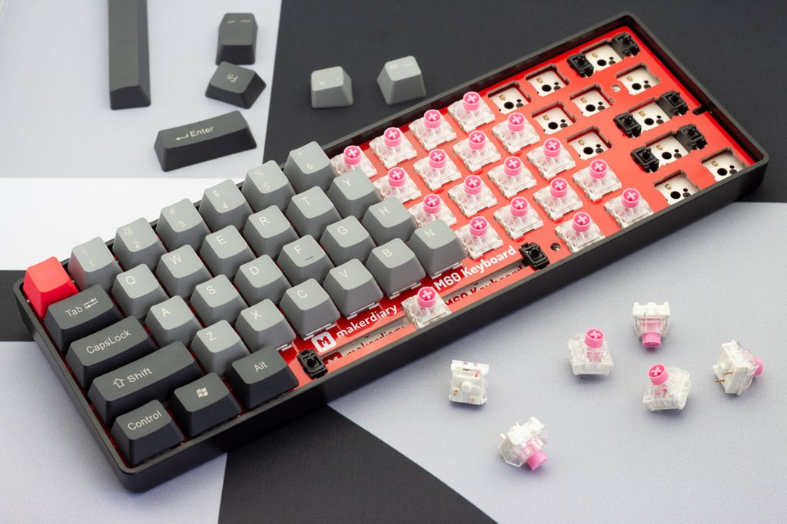
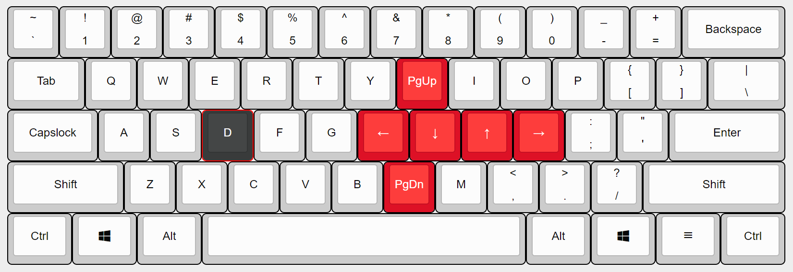

Python Keyboard
===============

 English | [中文][1]
---------|----------

From a hand-wired USB & Bluetooth keyboard powered by Python to production.

The Python keyboard works so well thanks to MicroPython and CircuitPython.


## Hand-wiring a keyboard
Follow [the guide - hand-wiring-a-keyboard.md](hand-wiring-a-keyboard.md) to rapidly make a keyboard with 100 lines of Python code.


## From prototype to production <sup><kbd>in progress</kbd></sup>
With putting more time into the Python keyboard, we find it more and more interesting. We think a Python keyboard can make a big difference, so we decide to design a new keyboard for everyone. Check out [the M60 mechanical keyboard](https://makerdiary.com/m60).

[](https://makerdiary.com/m60)

## To be a productive keyboard
As the 60% keyboard lacks a lot of keys (F1~F12, arrow keys and etc). We can add
[features like TMK's layers and composite keys](https://github.com/tmk/tmk_keyboard/blob/master/tmk_core/doc/keymap.md) to make the small keyboard much more powerful.
With the idea of [Toward a more useful keyboard](https://github.com/jasonrudolph/keyboard) to keep our fingers at the home row, we can optimize the keyboard to make us more productive.

Adding the Tap-key feature, which is holding a key down to activate an alternate function, can make a big difference.

### Using <kbd>D</kbd> for Navigation

Taping <kbd>d</kbd> outputs <kbd>d</kbd> (press & release quickly), holding <kbd>d</kbd> down activates navigation functions.



+ <kbd>d</kbd> + <kbd>h</kbd> as <kbd>←</kbd>
+ <kbd>d</kbd> + <kbd>j</kbd> as <kbd>↓</kbd>
+ <kbd>d</kbd> + <kbd>k</kbd> as <kbd>↑</kbd>
+ <kbd>d</kbd> + <kbd>l</kbd> as <kbd>→</kbd>
+ <kbd>d</kbd> + <kbd>u</kbd> as <kbd>PageUp</kbd>
+ <kbd>d</kbd> + <kbd>n</kbd> as <kbd>PageDown</kbd>

To apply the navigation <kbd>d</kbd>, copy `keyboard.py` and `action_code.py` to the USB drive of the keyboard, and then modify `code.py` to import the new keyboard

```python
# code.py

from keyboard import main

main()
```

### Using Pair-keys
Simultaneously pressing two keys (interval less than 25ms) activates an alternate function.


### Using <kbd>;</kbd> as <kbd>Ctrl</kbd>
WIP - Holding <kbd>;</kbd> down outputs <kbd>Ctrl</kbd>

## Todo
+ <kbd>;</kbd> as <kbd>Ctrl</kbd>
+ add macro
+ add system keys and cosumer keys
+ add mouse keys
+ reduce latency


## Credits
+ [MicroPython](https://github.com/micropython/micropython)
+ [CircuitPython](https://github.com/adafruit/circuitpython)


[1]: https://gitee.com/makerdiary/python-keyboard
