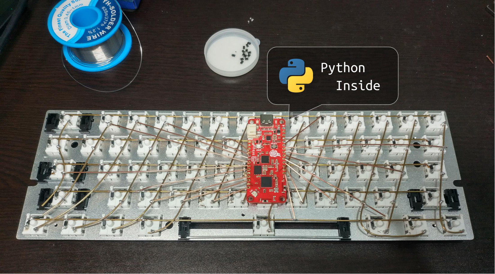
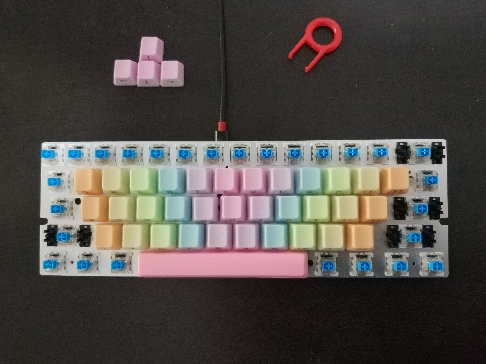

Hand-wiring a keyboard
======================



1.  [Hand-wire the keyboard](hardware.md)
2.  Follow [the guide - How to Program Pitaya Go](https://wiki.makerdiary.com/pitaya-go/programming/) to flash [CircuitPython firmware](circuitpython-5.3.0-for-pitaya-go.hex)
3.  Download two CircuitPython libraries - [adafruit-ble](https://github.com/adafruit/Adafruit_CircuitPython_BLE) & [adafruit-hid](https://github.com/adafruit/Adafruit_CircuitPython_HID) and put them into the `lib` directory of the USB drive named CIRCUITPY.

    ```
    CIRCUITPY
    ├───code.py
    └───lib
        ├───adafruit_ble
        └───adafruit_hid
    ```

4.  Copy the Python code to `code.py`. When `code.py` is reloaded, you will get a keyboard with USB & Bluetooth


    ```python
    import time
    from board import *
    import digitalio
    import usb_hid

    import adafruit_ble
    from adafruit_ble.advertising import Advertisement
    from adafruit_ble.advertising.standard import ProvideServicesAdvertisement
    from adafruit_ble.services.standard.hid import HIDService
    from adafruit_hid.keyboard import Keyboard
    from adafruit_hid.keycode import Keycode as _

    ROWS = (P27, P13, P30, P20, P3)
    COLS = (P26, P31, P29, P28, P5, P4, P24, P25, P23, P22, P14, P15, P16, P17)

    KEYMAP = (_.ESCAPE, _.ONE, _.TWO, _.THREE, _.FOUR, _.FIVE, _.SIX, _.SEVEN, _.EIGHT, _.NINE, _.ZERO, _.MINUS, _.EQUALS, _.BACKSPACE,
            _.TAB, _.Q, _.W, _.E, _.R, _.T, _.Y, _.U, _.I, _.O, _.P, _.LEFT_BRACKET, _.RIGHT_BRACKET, _.BACKSLASH,
            _.CAPS_LOCK, _.A, _.S, _.D, _.F, _.G, _.H, _.J, _.K, _.L, _.SEMICOLON, _.QUOTE, None, _.ENTER,
            _.LEFT_SHIFT, _.Z, _.X, _.C, _.V, _.B, _.N, _.M, _.COMMA, _.PERIOD, _.FORWARD_SLASH, None, _.RIGHT_SHIFT, None,
            _.LEFT_CONTROL, _.LEFT_ALT, _.LEFT_GUI, None, None, _.SPACE, None, None, _.RIGHT_ALT, _.RIGHT_GUI, _.APPLICATION, _.RIGHT_CONTROL, None, None)

    class Matrix:
        def __init__(self, rows=ROWS, cols=COLS):
            self.rows = []
            for pin in rows:
                io = digitalio.DigitalInOut(pin)
                io.direction = digitalio.Direction.OUTPUT
                io.drive_mode = digitalio.DriveMode.PUSH_PULL
                io.value = 0
                self.rows.append(io)
            self.cols = []
            for pin in cols:
                io = digitalio.DigitalInOut(pin)
                io.direction = digitalio.Direction.INPUT
                io.pull = digitalio.Pull.DOWN
                self.cols.append(io)
            self.pressed_keys = []

        def scan(self):
            new_keys = []
            pressed_keys = []
            released_keys = self.pressed_keys
            for r in range(len(self.rows)):
                self.rows[r].value = 1
                for c in range(len(self.cols)):
                    if self.cols[c].value:
                        key = r * len(self.cols) + c
                        pressed_keys.append(key)
                        if key in released_keys:
                            released_keys.remove(key)
                        else:
                            new_keys.append(key)
                self.rows[r].value = 0
            self.pressed_keys = pressed_keys
            return pressed_keys, released_keys, new_keys

    def main():
        hid = HIDService()
        advertisement = ProvideServicesAdvertisement(hid)
        advertisement.appearance = 961
        ble = adafruit_ble.BLERadio()
        if ble.connected:
            for c in ble.connections:
                c.disconnect()
        ble.start_advertising(advertisement)
        advertising = True
        ble_keyboard = Keyboard(hid.devices)

        matrix = Matrix()
        usb_keyboard = Keyboard(usb_hid.devices)

        while True:
            pressed_keys, released_keys, new_keys = matrix.scan()
            if released_keys:
                released_keycodes = list(map(lambda i: KEYMAP[i], released_keys))
                print('released keys {}'.format(released_keycodes))

                usb_keyboard.release(*released_keycodes)
                if ble.connected:
                    advertising = False
                    ble_keyboard.release(*released_keycodes)
            if new_keys:
                new_keycodes = list(map(lambda i: KEYMAP[i], new_keys))
                print('new keys {}'.format(new_keycodes))
                usb_keyboard.press(*new_keycodes)
                if ble.connected:
                    advertising = False
                    ble_keyboard.press(*new_keycodes)

            if not ble.connected and not advertising:
                ble.start_advertising(advertisement)
                advertising = True

            time.sleep(0.001)

    if __name__ == '__main__':
        main()
    ```

    If you have a different configuration of raws and columns, you must change `ROWS` and `COLS` in the code.

