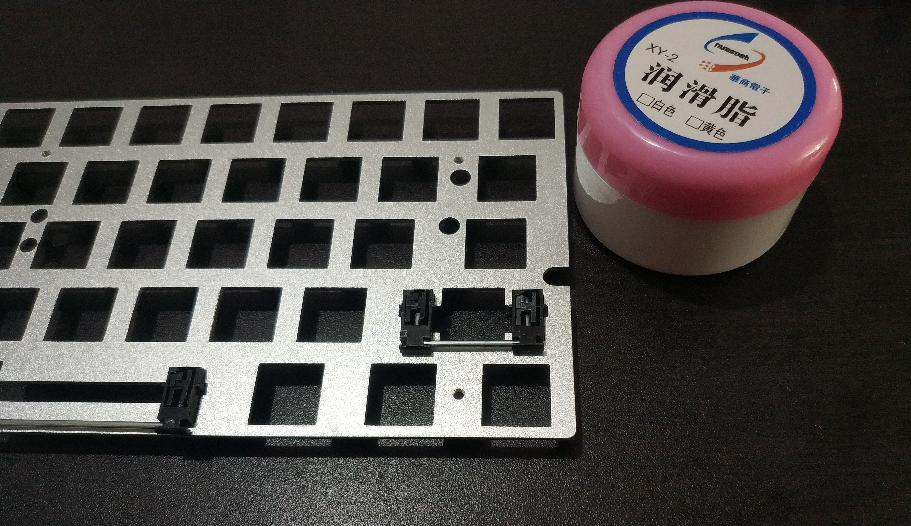
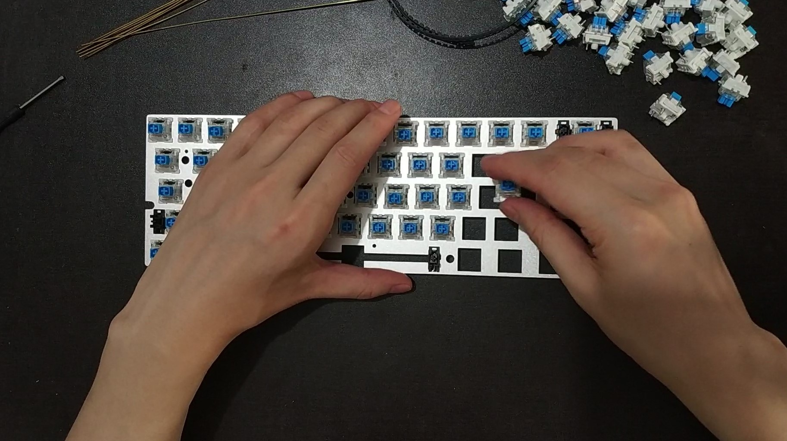
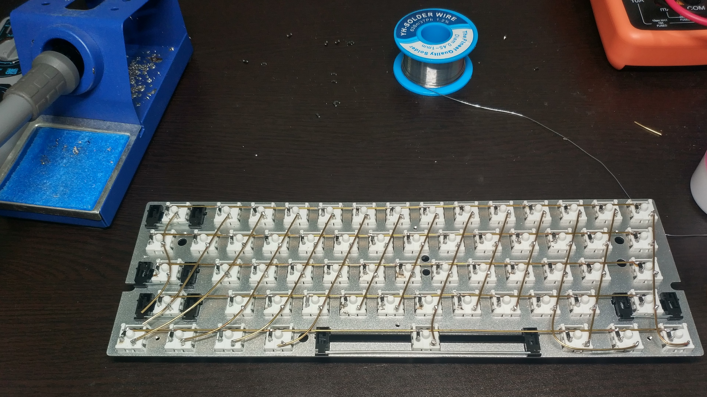

Hand-wiring a Keyboard
======================

## 0. Preparing

## Materials

+ 0.8mm brass wire
+ 61+ mechanical switches
+ keybaord plate
+ plate mount stabilizers
+ 61+ diodes for anti-ghost
+ [Pitaya Go](https://github.com/makerdiary/pitaya-go)

## Tools

+ soldering iron
+ solder alloy
+ tweezer
+ multimeter

## 1. Install Stabilizers
At first, we should install stabilizers into the keyboard plate. To make the keyboard less noisy, we can lubricate the stabilizers with grease.

## 2. Mount Switches
Mount the mechanical switches to the plate.

## 3. Solder Keyboard Matrix

The keyboard matrix has 5 rows and 14 columns, each switch has two pins to connect to a row and a column. First, use a brass wire as a row and solder it with a diode. Second, solder the diode with a switch's row pin. After soldering all rows, we put something as a spacer on top of the row wires, and then solder the column wires with the column pins of these switches. By removing the spacer, the rows and columns are crossed in 3D space and are avoid to be shorted.  We'd better use a muiltmeter to check if rows and columns are shorted and each diode's direction is correct.

## 4. Connect Keyboard Matrix to Pitaya Go

Connect each row and each column to an IO of the board Pitaya Go. When ardware is ready now, check if rows and columns are shorted before power on.

## 5. Setup Python

Go to [README.md](README.md) to setup Python on the keyboard.

